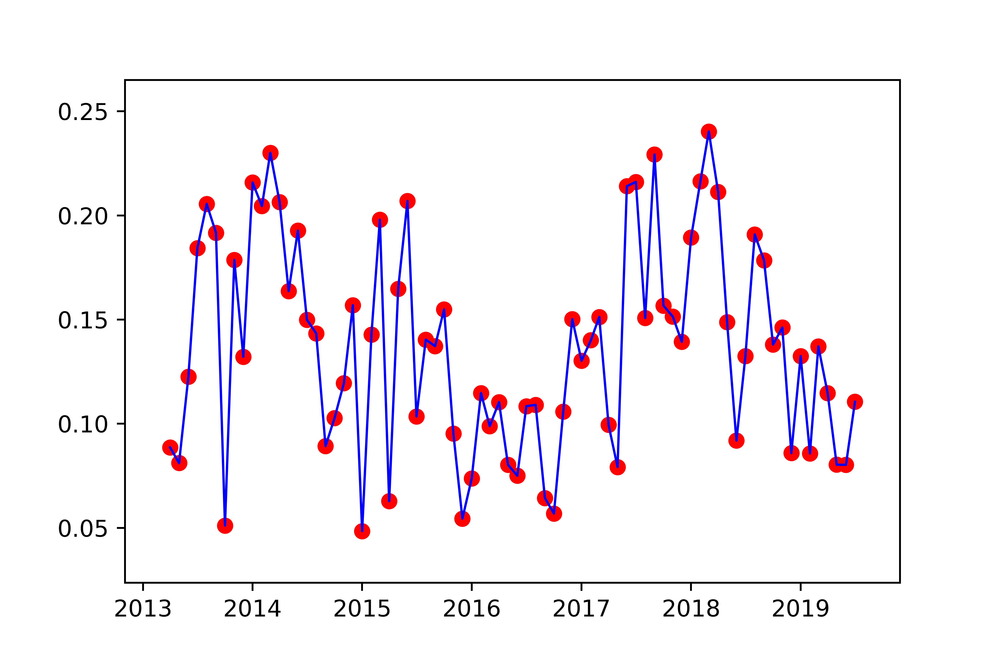
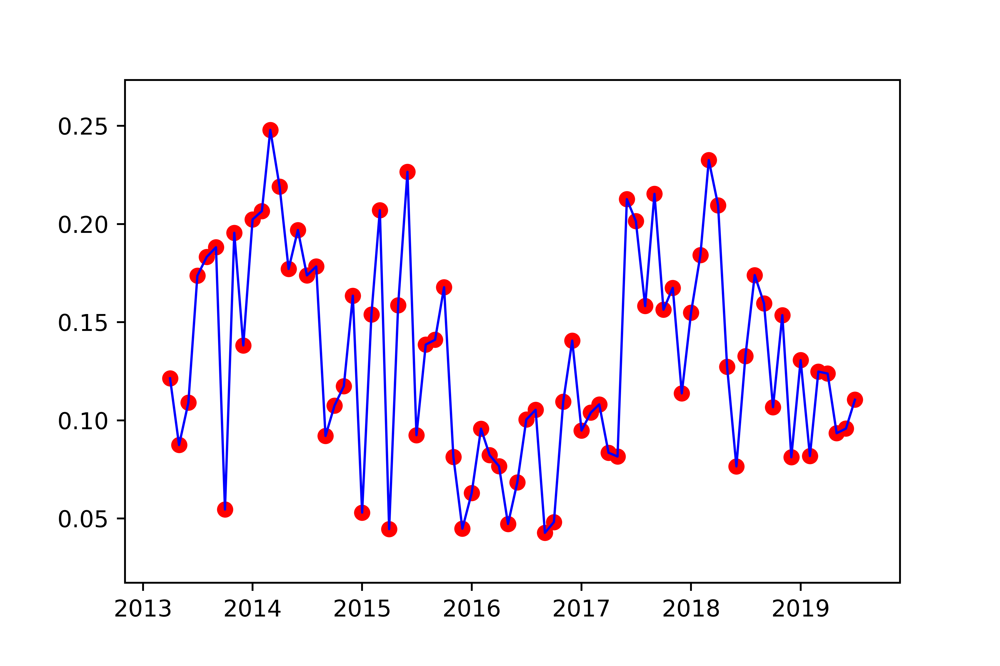
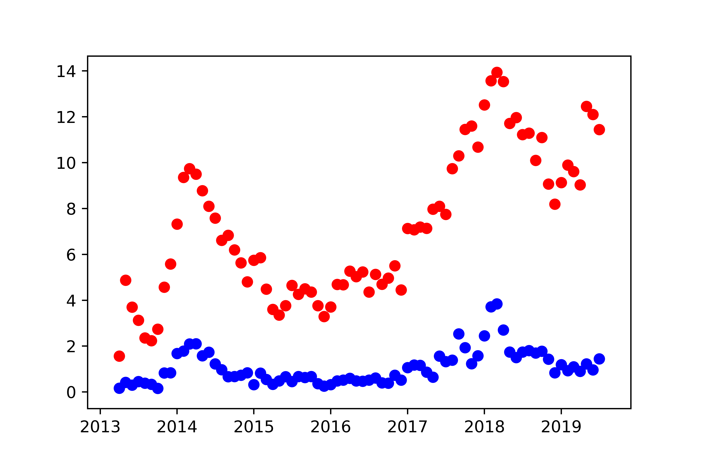
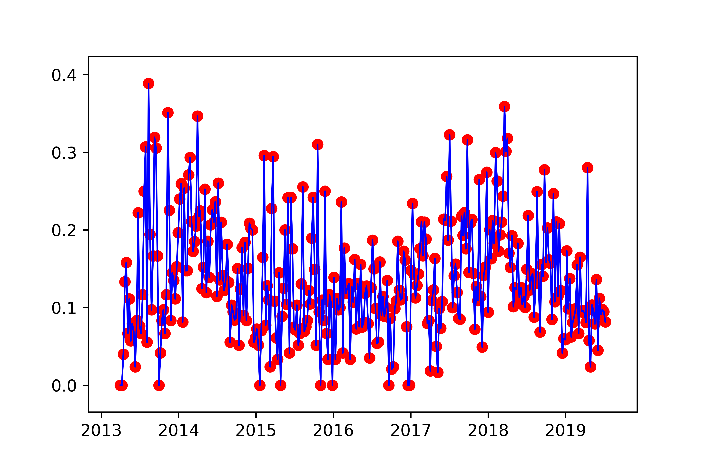
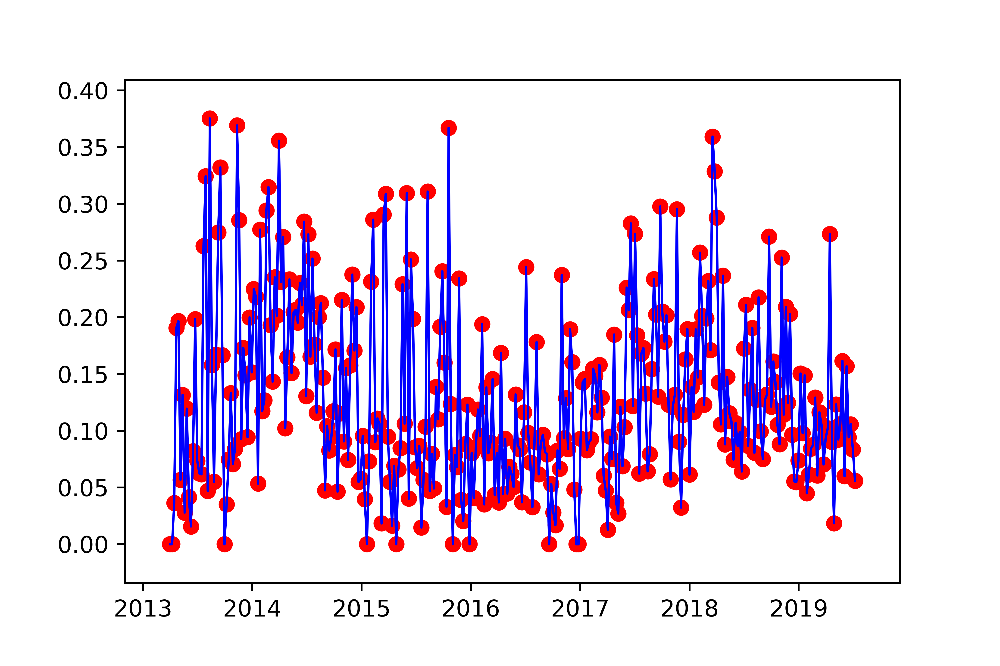

[](http://quantlet.de/)

## [](http://quantlet.de/) **Regulatory_risk_coindesk** [](http://quantlet.de/)

```yaml


Name of Quantlet: Regulatory_risk_coindesk  

Published in: Regulatory_risk_cryptocurrency

Description: Analysis the regulatory risk of cryptocurrency market using the scrapped news data from Coindesk.com

Keywords: LDA, topic modelling, regulatory risk, regulation, Cryptocurrency

See also: LDA-DTM_NASDAQ, Regulatory_risk_BTC_magazine

Author: Xinwen Ni

Submitted:  01 OCT 2019


```













### PYTHON Code
```python

#!/usr/bin/env python3
# -*- coding: utf-8 -*-
"""
Created on Wed Jul 24 11:12:54 2019

@author: xinwenni
"""

import pandas as pd
from datetime import datetime
# from datetime import timedelta
import matplotlib.pyplot as plt
# import numpy as np
# import datetime
# import calendar

# import re


def datelist(beginDate, endDate):
    date_l = [datetime.strftime(x, '%Y-%m-%d') for x in
              list(pd.date_range(start=beginDate, end=endDate))]
    return date_l


df1 = pd.read_csv("regulation_news.csv")
df = pd.read_csv("coindesk_news_20190718.csv")
df1 = df1.drop(columns=['Unnamed: 0'])
#df1.columns = ['titles', 'authors', 'contents', 'releases', 'updates',
#                'imgs', 'tags', 'bars']

df = df.T
df = df.drop(index=['Unnamed: 0'])
df.columns = ['titles', 'authors', 'introduces', 'contents', 'releases',
              'updates', 'urls', 'imgs', 'tags', 'bars']


doc = {}
for i in range(len(df)):
    Temp = df.iloc[i]
    tmp_stamp = Temp.get("releases")
    try:
        tmp_date = datetime.strptime(str(tmp_stamp[0:12]), '%b %d, %Y').date()
    except:
        tmp_date = datetime.strptime(str(tmp_stamp[0:11]), '%b %d, %Y').date()
#    tmp_time = tmp_stamp[11:19]
    tmp_title = Temp.get("titles")
    tmp_txt = Temp.get("contents")
    mylen = len(tmp_txt)
    line_num = tmp_txt.count("\n")
    words_num = len(tmp_txt.split())
    if tmp_date in doc:
        doc[tmp_date]['Article'].append((tmp_title, tmp_txt, mylen, line_num, words_num))
    else:
        doc[tmp_date] = {'Article' : [(tmp_title, tmp_txt, mylen, line_num, words_num)]}
    i = i+1

    ls = []

    for key in doc.keys():
        if 'Article' in doc[key]:
            for l in range(len(doc[key]['Article'])):
                    ls.append([key,
                               doc[key]['Article'][l][0],
                               doc[key]['Article'][l][1],
                               doc[key]['Article'][l][2],
                               doc[key]['Article'][l][3],
                               doc[key]['Article'][l][4]])
    df_news = pd.DataFrame.from_records(ls)
    df_news.columns = ['Date', 'Title', 'Content', 'Length', 'line_num', 'words_num']


df_news.to_csv('news_counts.csv')


doc = {}
for i in range(len(df1)):
    Temp = df1.iloc[i]
    tmp_stamp = Temp.get("releases")
    try:
        tmp_date = datetime.strptime(str(tmp_stamp[0:12]), '%b %d, %Y').date()
    except:
        tmp_date = datetime.strptime(str(tmp_stamp[0:11]), '%b %d, %Y').date()
#    tmp_time = tmp_stamp[11:19]
    tmp_title = Temp.get("titles")
    tmp_txt = Temp.get("contents")
    mylen = len(tmp_txt)
    line_num = tmp_txt.count("\n")
    words_num = len(tmp_txt.split())
    if tmp_date in doc:
        doc[tmp_date]['Article'].append((tmp_title, tmp_txt, mylen, line_num, words_num)) 
    else:
        doc[tmp_date] = {'Article' : [(tmp_title, tmp_txt, mylen, line_num, words_num)]}
    i = i+1
    ls = []

    for key in doc.keys():
        if 'Article' in doc[key]:
            for l in range(len(doc[key]['Article'])):
                    ls.append([key,
                               doc[key]['Article'][l][0],
                               doc[key]['Article'][l][1],
                               doc[key]['Article'][l][2],
                               doc[key]['Article'][l][3],
                               doc[key]['Article'][l][4]])

    df_regulation = pd.DataFrame.from_records(ls)
    df_regulation.columns = ['Date', 'Title', 'Content', 'Length', 'line_num', 'words_num']

df_regulation.to_csv('regulation_counts.csv')


# df_news=pd.read_csv("news_counts.csv")
# df_news=df_news.drop(columns=['Unnamed: 0'])
# df_regulation=pd.read_csv("regulation_counts.csv")
# df_regulation=df_regulation.drop(columns=['Unnamed: 0'])


# first_date=datetime.strptime(df_news.iloc[0].get('Date'),'%Y-%m-%d').date()
# first_date=df_news.iloc[0].get('Date')
# last_date=df_news.iloc[-1].get('Date')
# Datelist=datelist(first_date,last_date)
Datelist = datelist('20130401', '20190718')
Datelist = pd.DataFrame(Datelist)
Datelist.columns = ['Date']
for i in range(len(Datelist)):
    Datelist.ix[i,'Date'] = datetime.strptime(Datelist.ix[i,'Date'], '%Y-%m-%d').date()

df_agg = pd.concat([Datelist, pd.DataFrame(columns = ['News_num']),
                 pd.DataFrame(columns = ['News_len']),
                 pd.DataFrame(columns = ['News_line']),
                 pd.DataFrame(columns = ['News_words']),
                 pd.DataFrame(columns = ['Reg_num']),
                 pd.DataFrame(columns = ['Reg_len']),
                 pd.DataFrame(columns = ['Reg_line']),
                 pd.DataFrame(columns = ['Reg_words'])])
    
for i in range(len(Datelist)):
    temp_num = 0
    temp_len = 0
    temp_line = 0
    temp_words = 0
    for j in range(len(df_news)):
        if str(df_agg.Date[i]) == df_news.Date[j]:
            temp_num = temp_num+1
            temp_len = temp_len+df_news.Length[j]
            temp_line = temp_line+df_news.line_num[j]
            temp_words = temp_words+df_news.words_num[j]
    df_agg.News_num[i] = temp_num
    df_agg.News_len[i] = temp_len
    df_agg.News_line[i] = temp_line
    df_agg.News_words[i] = temp_words
    temp1_num = 0
    temp1_len = 0
    temp1_line = 0
    temp1_words = 0
    for k in range(len(df_regulation)):
        if str(df_agg.Date[i]) == df_regulation.Date[k]:
            temp1_num = temp1_num+1
            temp1_len = temp1_len+df_regulation.Length[k]
            temp1_line = temp1_line+df_regulation.line_num[k]
            temp1_words = temp1_words+df_regulation.words_num[k]
    df_agg.Reg_num[i] = temp1_num
    df_agg.Reg_len[i] = temp1_len
    df_agg.Reg_line[i] = temp1_line
    df_agg.Reg_words[i] = temp1_words


# df_temp=df_agg.drop(columns=['Ratio_num','Ratio_len','Ratio_line','Ratio_words'])
# df_temp.to_csv('daily_count_news_regulation.csv')

df_agg = pd.concat([df_agg, pd.DataFrame(columns = ['Ratio_num']),
                 pd.DataFrame(columns = ['Ratio_len']),
                 pd.DataFrame(columns = ['Ratio_line']),
                 pd.DataFrame(columns = ['Ratio_words'])])

for i in range(len(Datelist)):
    if df_agg.News_num[i] == 0:
        i = i
    else:
        df_agg.Ratio_num[i] = df_agg.Reg_num[i]/df_agg.News_num[i]
        df_agg.Ratio_len[i] = df_agg.Reg_len[i]/df_agg.News_len[i]
        df_agg.Ratio_line[i] = df_agg.Reg_line[i]/df_agg.News_line[i]
        df_agg.Ratio_words[i] = df_agg.Reg_words[i]/df_agg.News_words[i]

df_agg.to_csv('daily_ratio.csv')


# convert daily to weekly
df_daily = pd.read_csv('daily_ratio.csv')
df_daily = df_daily.drop(columns=['Unnamed: 0'])

df_daily['Date'] = pd.to_datetime(df_daily['Date'])
# Getting week number
df_daily['Week_Number'] = df_daily['Date'].dt.week
df_daily['Month_Number'] = df_daily['Date'].dt.month
# Getting year. Weeknum is common across years to we need to create unique index by using year and weeknum
df_daily['Year'] = df_daily['Date'].dt.year

# generate the monthly data
#df_weekly = df_daily.groupby(['Year','Week_Number']).agg({'News_len': 'mean','News_line': 'mean','News_num': 'mean','News_words': 'mean','Reg_len': 'mean','Reg_line': 'mean','Reg_num': 'mean','Reg_words': 'mean','Ratio_len': 'mean','Ratio_line': 'mean','Ratio_num': 'mean','Ratio_words': 'mean'})
df_monthly = df_daily.groupby(['Year','Month_Number']).agg({'News_len': 'mean','News_line': 'mean','News_num': 'mean','News_words': 'mean','Reg_len': 'mean','Reg_line': 'mean','Reg_num': 'mean','Reg_words': 'mean','Ratio_len': 'mean','Ratio_line': 'mean','Ratio_num': 'mean','Ratio_words': 'mean'})
df_monthly = pd.concat([df_monthly, pd.DataFrame(columns = ['Date'])])

mydate = datetime.date(2013, 4 , 1)
df_monthly.Date[0]=mydate
for k in range(len(df_monthly)-1):
    df_monthly.Date[k+1]= datetime.date(mydate.year + int(mydate.month / 12), ((mydate.month % 12) + 1), 1)
    mydate=df_monthly.Date[k+1] 
df_monthly.to_csv('monthly_ratio.csv')

# generate the weekly data 
weekly_date={}
# Grouping based on required values
for i in range(int(len(df_daily)/7)):
    weekly_date[i]=df_daily.Date[7*i]
weekly_date  = pd.DataFrame.from_dict(weekly_date,orient='index')
#df_weekly = pd.concat([df_weekly, pd.DataFrame(columns = ['News_len'])])
weekly_tem={}
for i in range(len(weekly_date)):
    weekly_tem[i]=df_daily.iloc[i*7:i*7+6,1:13].mean(0)
df_weekly  = pd.DataFrame.from_dict(weekly_tem,orient='index')

df_weekly = pd.concat([df_weekly, pd.DataFrame(columns = ['Date'])])
df_weekly.Date=weekly_date
df_weekly.to_csv('weekly_ratio.csv')

#plot 
fig = plt.figure()
ax1 = fig.add_subplot(111)
ax1.scatter(df_weekly.Date,df_weekly.News_num,c = 'r',marker = 'o')
ax1.scatter(df_weekly.Date,df_weekly.Reg_num,c = 'b',marker = 'o')
plt.savefig('Num_of_news_and_reg_weekly.png',dpi = 720,transparent=True)
plt.show()

fig = plt.figure()
ax1 = fig.add_subplot(111)
ax1.scatter(df_monthly.Date,df_monthly.News_num,c = 'r',marker = 'o')
ax1.scatter(df_monthly.Date,df_monthly.Reg_num,c = 'b',marker = 'o')
plt.savefig('Num_of_news_and_reg_monthly.png',dpi = 720,transparent=True)
plt.show()

fig = plt.figure()
ax1 = fig.add_subplot(111)
ax1.scatter(df_weekly.Date,df_weekly.Ratio_num,c = 'r',marker = 'o')
ax1.plot(df_weekly.Date,df_weekly.Ratio_num,'b',linewidth=1, markersize=1)
plt.savefig('Weekly_num_ratio.png',dpi = 720,transparent=True)
plt.show()

fig = plt.figure()
ax1 = fig.add_subplot(111)
ax1.scatter(df_weekly.Date,df_weekly.Ratio_words,c = 'r',marker = 'o')
ax1.plot(df_weekly.Date,df_weekly.Ratio_words,'b',linewidth=1, markersize=1)
plt.savefig('Weekly_words_ratio.png',dpi = 720,transparent=True)
plt.show()


fig = plt.figure()
ax1 = fig.add_subplot(111)
ax1.scatter(df_monthly.Date,df_monthly.Ratio_num,c = 'r',marker = 'o')
ax1.plot(df_monthly.Date,df_monthly.Ratio_num,'b',linewidth=1, markersize=1)
plt.savefig('Monthly_num_ratio.png',dpi = 720,transparent=True)
plt.show()

fig = plt.figure()
ax1 = fig.add_subplot(111)
ax1.scatter(df_monthly.Date,df_monthly.Ratio_words,c = 'r',marker = 'o')
ax1.plot(df_monthly.Date,df_monthly.Ratio_words,'b',linewidth=1, markersize=1)
plt.savefig('Monthly_words_ratio.png',dpi = 720,transparent=True)
plt.show()


import nltk; nltk.download('stopwords')


import re
import numpy as np
import pandas as pd
from pprint import pprint

# Gensim
import gensim
import gensim.corpora as corpora
from gensim.utils import simple_preprocess
from gensim.models import CoherenceModel

# spacy for lemmatization
import spacy

# Plotting tools
import pyLDAvis
import pyLDAvis.gensim  # don't skip this
import matplotlib.pyplot as plt
#matplotlib inline

# Enable logging for gensim - optional
import logging
logging.basicConfig(format='%(asctime)s : %(levelname)s : %(message)s', level=logging.ERROR)

import warnings
warnings.filterwarnings("ignore",category=DeprecationWarning)


from nltk.corpus import stopwords
stop_words = stopwords.words('english')
stop_words.extend(['from', 'use','also'])

df_regulation =pd.read_csv("regulation_counts.csv")
df_regulation.head()

# Convert to list
data = df_regulation.Content.values.tolist()

# Remove Emails
data = [re.sub('\S*@\S*\s?', '', sent) for sent in data]

# Remove new line characters
data = [re.sub('\s+', ' ', sent) for sent in data]

# Remove distracting single quotes
data = [re.sub("\'", "", sent) for sent in data]

pprint(data[:1])

def sent_to_words(sentences):
    for sentence in sentences:
        yield(gensim.utils.simple_preprocess(str(sentence), deacc=True))  # deacc=True removes punctuations

data_words = list(sent_to_words(data))

print(data_words[:1])

# Build the bigram and trigram models
bigram = gensim.models.Phrases(data_words, min_count=5, threshold=100) # higher threshold fewer phrases.
trigram = gensim.models.Phrases(bigram[data_words], threshold=100)  

# Faster way to get a sentence clubbed as a trigram/bigram
bigram_mod = gensim.models.phrases.Phraser(bigram)
trigram_mod = gensim.models.phrases.Phraser(trigram)

# See trigram example
print(trigram_mod[bigram_mod[data_words[0]]])

# Define functions for stopwords, bigrams, trigrams and lemmatization
def remove_stopwords(texts):
    return [[word for word in simple_preprocess(str(doc)) if word not in stop_words] for doc in texts]

def make_bigrams(texts):
    return [bigram_mod[doc] for doc in texts]

def make_trigrams(texts):
    return [trigram_mod[bigram_mod[doc]] for doc in texts]

def lemmatization(texts, allowed_postags=['NOUN', 'ADJ', 'VERB', 'ADV']):
    """https://spacy.io/api/annotation"""
    texts_out = []
    for sent in texts:
        doc = nlp(" ".join(sent)) 
        texts_out.append([token.lemma_ for token in doc if token.pos_ in allowed_postags])
    return texts_out

# Remove Stop Words
data_words_nostops=remove_stopwords(data_words)

# Form Bigrams
data_words_bigrams = make_bigrams(data_words_nostops)

# Initialize spacy 'en' model, keeping only tagger component (for efficiency)
# python3 -m spacy download en
nlp = spacy.load('en', disable=['parser', 'ner'])

# Do lemmatization keeping only noun, adj, vb, adv
data_lemmatized = lemmatization(data_words_nostops, allowed_postags=['NOUN', 'ADJ', 'VERB', 'ADV'])

#data_lemmatized = lemmatization(data_words_bigrams, allowed_postags=['NOUN', 'ADJ', 'VERB', 'ADV'])

print(data_lemmatized[:1])

# Create Dictionary
id2word = corpora.Dictionary(data_lemmatized)

# Create Corpus
texts = data_lemmatized

# Term Document Frequency
corpus = [id2word.doc2bow(text) for text in texts]

# View
print(corpus[:1])

#Gensim creates a unique id for each word in the document. The produced corpus shown above is a mapping of (word_id, word_frequency).
#
#For example, (0, 1) above implies, word id 0 occurs once in the first document. Likewise, word id 1 occurs twice and so on.
id2word[0]

# Human readable format of corpus (term-frequency)
[[(id2word[id], freq) for id, freq in cp] for cp in corpus[:1]]

num_topic=1

lda_model = gensim.models.ldamodel.LdaModel(corpus=corpus,
                                           id2word=id2word,
                                           num_topics=num_topic, 
                                           random_state=100,
                                           update_every=1,
                                           chunksize=100,
                                           passes=15,
                                           alpha='auto',
                                           per_word_topics=True)


# Print the Keyword in the 10 topics
pprint(lda_model.print_topics(1,30))
doc_lda = lda_model[corpus]


# Compute Perplexity
print('\nPerplexity: ', lda_model.log_perplexity(corpus))  # a measure of how good the model is. lower the better.

# Compute Coherence Score
coherence_model_lda = CoherenceModel(model=lda_model, texts=data_lemmatized, dictionary=id2word, coherence='c_v')
coherence_lda = coherence_model_lda.get_coherence()
print('\nCoherence Score: ', coherence_lda)


```

automatically created on 2020-01-06